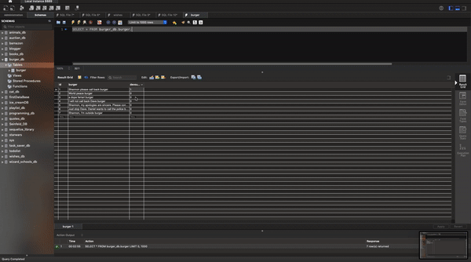

# Eat-Da-Burger-
Demonstration of MVC paradigm, facilitated using express, MySQL, Handlebars and Node.js

<h1>Application Description</h1>
  
  
 This app allows you to create named burgers, and then eat them. This demonstrates interaction with a database, 
specifically CRU functions on a server and affecting HTML using express, MySQL, and Handlebars.

<h1> Application Demonstration </h1>

<h4> We can see here that the buttons and form add and change the boolean values in the database. </h4>

<h2>Outstanding Issues</h2>

 The whole application could use some design work. It is functional but has pointy edges. Additionally, the project has no applicable value, and is simply a demonstration of skills 

<h2> Future Directions </h2>

<h4> Options for this app are fairly limited as far as future directions. With Heroku deployment there isn't much more to add 
  besides unnecessary complexity. In theory "ingredients" could be added to each burger, and a delete function could be 
  implemented as well. Design elements could be added as well, and in theory this application could be adapted in many ways depending on a project's needs. </h4>
